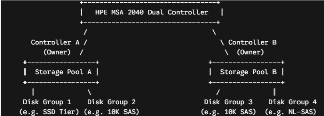
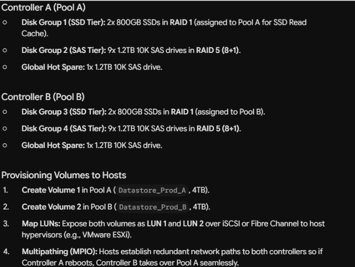
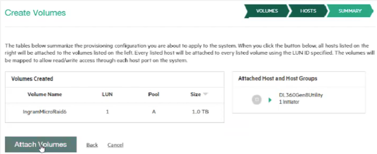

# Outline

- [Outline](#outline)
- [iSCSI](#iscsi)
  - [What it is](#what-it-is)
  - [Key Components: Initiators and Targets](#key-components-initiators-and-targets)
  - [Fiber Channel](#fiber-channel)
  - [Networking Best Practices for iSCSI](#networking-best-practices-for-iscsi)
- [SAN](#san)
  - [SAN, NAS, DAS](#san-nas-das)
  - [Disk Group, Storage Pool, Volume, LUN](#disk-group-storage-pool-volume-lun)
  - [Pool/Controller Management](#poolcontroller-management)
  - [Automated Data Tiering](#automated-data-tiering)
    - [Virtual Storage Pooling](#virtual-storage-pooling)
    - [Sub-LUN Automated Tiering](#sub-lun-automated-tiering)
    - [How automated tiering works](#how-automated-tiering-works)
  - [LUN Assignment Process](#lun-assignment-process)
  - [How `SAN Array` sees `ESXi Hosts`](#how-san-array-sees-esxi-hosts)
  - [Configure iSCSI Initiator (`esxi`)](#configure-iscsi-initiator-esxi)

# iSCSI

## What it is

- Internet Small Computer Systems Interface

- It is a networking protocol used to connect data storage servers to computers or hypervisors (like ESXi) over standard ethernet cables

- `SCSI`

    - `SCSI` is the traditional protocol computers use to talk to internal hard drives using commands like "write this data to sector 4" or "read sector 12"

    - `iSCSI` takes those exact same low-level storage commands, wraps them inside standard TCP/IP packets, and sends them over your regular network wires

    - When the data reaches the storage array, the network packets are stripped away, leaving the original `SCSI` storage commands to be executed on the disks

## Key Components: Initiators and Targets

- The iSCSI Initiator (The Client): This is the device that needs storage
  
    - `ESXi` host acts as the initiator

    - It issues commands to read and write data

    - Initiators can be software built into the OS, or dedicated hardware network cards

- The iSCSI Target (The Server/Storage)

    - This is the storage appliance that has the disks (often a SAN—Storage Area Network—or a NAS like a Synology or TrueNAS)

    - The target advertises specific chunks of storage, which are called LUNs (Logical Unit Numbers)

    - To your ESXi host, a LUN looks exactly like a blank, unformatted physical hard drive

## Fiber Channel

- Before iSCSI, if you wanted high-speed, centralized storage for servers, you had to use Fibre Channel (FC)

- Fibre Channel is incredibly fast but requires expensive, dedicated optical switches, specialized Host Bus Adapter (HBA) cards, and separate cabling

## Networking Best Practices for iSCSI

- `iSCSI` traffic should live on its own isolated VLAN and use dedicated physical NICs (`vmnic`)

- Change the packet size limit (MTU) to 9000 bytes across the ESXi VMkernel port, the physical switches, and the storage target

    - Standard network packets are 1,500 bytes

    - Storage data moves in massive blocks

- No Routing (Keep it Layer 2): iSCSI traffic should never pass through a router or firewall if it can be avoided

- The ESXi host (vmk2) and the Storage Target should be on the exact same subnet/VLAN to minimize latency

# SAN

## SAN, NAS, DAS

- SAN

    - How it connects: Connects via specialized high-speed networks (Fibre Channel or iSCSI)

    - How it functions: Presents storage to servers at the block level. The server's operating system treats the storage array like a locally attached hard drive

    - Use Cases: Ideal for heavy-duty applications like virtual machine hypervisors, databases, and large-scale enterprise data centers

- NAS

    - How it connects: Connects directly to your local area network (LAN) using standard Ethernet cables

    - How it functions: Presents storage at the file level (using protocols like NFS or SMB/CIFS). Users and servers interact directly with files and folder structures

    - Use Cases: Perfect for general-purpose file sharing, active collaboration, and archival storage across multiple users in a home or office network

- DAS

    - How it connects: Plugs directly into a single server or workstation via cables like SAS, SATA, or USB

    - How it functions: Does not communicate over a network; it is dedicated exclusively to the host device it is physically attached to

    - Use Cases: Good for local server expansion, isolated workstation storage, or personal backups

## Disk Group, Storage Pool, Volume, LUN

- Disk Group

    - A Disk Group (sometimes called a VDisk or RAID Group) is a collection of physical drives (HDDs or SSDs) bound together to form a protected array 

    - What it does: It applies a specific RAID level (e.g., RAID 10, RAID 5, RAID 6) across those disks to provide data redundancy and performance aggregation

- Storage Pool

    - A Storage Pool is a logical container that aggregates the storage space from one or more Disk Groups into a single large reservoir of capacity 

    - What it does: It abstracts the underlying disk groups so you can manage storage as a single, flexible block
    
    - Modern SANs use pools to enable features like thin provisioning, auto-tiering (moving active data to SSDs and cold data to HDDs), and snapshot overhead management 

    - Analogy: If a Disk Group is a bucket of water, a Storage Pool is a large water tank created by pouring multiple buckets together

- Volume

    - A Volume is a specific portion of storage carved out from the Storage Pool 

    - What it does: This is the administrative boundary where you define capacity (e.g., a "500GB Volume"), set thin/thick provisioning options, and manage array-level snapshots or replication

    - Analogy: Carving a 500GB volume out of your storage pool is like drawing a 500GB partition line inside that large water tank

- LUN

    - A LUN is technically an address/identifier used by the SAN fabric and host servers to direct read/write commands to a specific volume over iSCSI or Fibre Channel 

    - Engineers often use "volume" and "LUN" interchangeably in daily conversation, the Volume is the storage unit on the SAN
    
    - LUN ID (e.g., LUN 0, LUN 1) is how the host hypervisor or OS like (VMware ESXi or Windows Server) identifies and addresses that volume across the SAN fabric

    - Analogy: If the Volume is a specific apartment unit inside a building, the LUN is the street address number on the front door that tells the delivery driver (the server) where to drop off the package (data)

## Pool/Controller Management

- Dual-controller Architecture

    - Splitting physical drives across Pool A (owned by Controller A) and Pool B (owned by Controller B)

    - By splitting disks into 2 symmetrical pools, read/write workloads are distributed evenly across both controllers

    - Example

        

- Never mix drive types, speeds, or capacities within the same Disk Group

- Example: A 6-disk group should consist of 6x identical 1.2TB 10K SAS drives

- Example Enterprise Layout

    

## Automated Data Tiering

### Virtual Storage Pooling

- When you create a volume from a storage pool, you do not manually pick Disk Group 1 or Disk Group 2 

- From an administrative perspective:

    - You select `Pool A` (or `Pool B`)

    - You specify the volume size (e.g., 2TB)

    - You present that volume to your host server as a `LUN`

### Sub-LUN Automated Tiering

- Even though you don't pick the disk group manually, the SAN itself keeps track of the drive types inside that pool using a feature called **Sub-LUN Automated Tiering** 

- When you write data to a volume, the SAN doesn't just write it and leave it in one place forever

- It dynamically relocates smaller chunks of data across different disk groups based on how often that data is used

### How automated tiering works

- Block Breakdown: The SAN Array divides your volume's data into small pages (typically 4MB chunks)

- Access Tracking: The storage controllers continuously track how frequently each 4MB chunk is read or written

- Auto-Tiering Promotion/Demotion:

    - Hot Data: Frequently accessed blocks (like active database tables or boot drives) are automatically promoted up to the SSD Disk Group inside the pool

    - Warm Data: Standard virtual machine OS drives sit in the 10K Enterprise SAS Disk Group

    - Cold Data: Inactive data (like old snapshots or untouched log files) gets demoted down to the NL-SAS Disk Group to free up high-speed storage

## LUN Assignment Process

- You create a Volume in Pool A on the MSA (e.g., `MSA_Vol_Prod_01`, Size: 4TB)

- You map that Volume as `LUN 10` to the `iSCSI IP addresses` or `FC WWNs` of your ESXi hosts

    

- The SAN's job is now done. It just presents **a raw, unformatted 4TB SCSI disk** address over the network

- On the ESXi host

    - In VMware vCenter, you click "Rescan Storage."

    - ESXi detects a new raw 4TB storage device at LUN 10

    - You format this raw LUN with VMware's clustered file system called VMFS (Virtual Machine File System)

        - Formatting raw `LUNs` with `VMFS` is the standard practice for almost all VMware environments

        - VMFS: Standard file systems (like `NTFS` or `ext4`) can only be read/written by one server at a time
        
        - VMFS is special because it allows multiple ESXi hosts in a cluster to read and write to the exact same SAN volume simultaneously without corrupting data

- Virtual Machine Side (`.VMDK` Files)

    - Now that you have a 4TB Datastore, you don't assign the whole thing to one VM. You carve it up into Virtual Machine Disk (`.vmdk`) files 

    - You create VM 1 (a Windows Server) and assign it a 100GB hard drive ⇒ VMware creates a file called `VM1_Disk1.vmdk` inside `Datastore_Gold_01 `

    - Inside the guest operating system, Windows (VM 1) has no idea it's living on an HPE MSA SAN or inside a `.vmdk` file. It just sees a standard 100GB SCSI Disk and formats it as `C:\` 

## How `SAN Array` sees `ESXi Hosts`

- `SAN` maps the volume to a unique string identifier called an `IQN` (iSCSI Qualified Name) - NOT directly to the ESXi host's IP address (the `vmk` port)

- Before you can map any volumes, two things must happen

    - ESXi Host: Software iSCSI Adapter, IP, IQN (e.g., `iqn.1998-01.com.vmware:esxi01-1a2b3c4d`)

    - SAN Array: Controller A/B Ports, IP ⇒ discover initiator IQN

## Configure iSCSI Initiator (`esxi`)

- Step A: Configure the iSCSI Initiator on ESXi 

    - On the ESXi host, you turn on the `Software iSCSI Adapter` in vSphere

    - VMware automatically generates a unique IQN for that host 

    - Example IQN: `iqn.1998-01.com.vmware:esxi01-6f4a8b12` 

    - You assign a static IP address to an ESXi `vmkernel` port dedicated to `iSCSI` (e.g., `192.168.10.50`)

- Step B: The "Handshake" (Discovery)

    - On `esxi`, under the `iSCSI` adapter settings, you enter the Controller IP addresses (e.g., `192.168.10.10` and `192.168.10.11`) as the Dynamic Target

    - `esxi` sends a packet across the network saying: "Hello MSA, I am `iqn.1998-01.com.vmware:esxi01-6f4a8b12` coming from `192.168.10.50`. What storage do you have for me?"

    - Once that ping occurs, the MSA logs that IQN in its Initiator Table

- What You See in the SAN Web Interface

    - Now when you log into the SAN Web GUI

    - You navigate to the Hosts / Initiators section

    - Under "Unassociated Initiators", you will see that incoming IQN (`iqn.1998-01.com.vmware:esxi01-...`)

    - You create a Host Object (e.g., name it `ESXi_Host_01`) and bind that discovered IQN to it

    - If you have multiple ESXi hosts in a cluster, you group them into a Host Group (e.g., `Prod_ESXi_Cluster`)