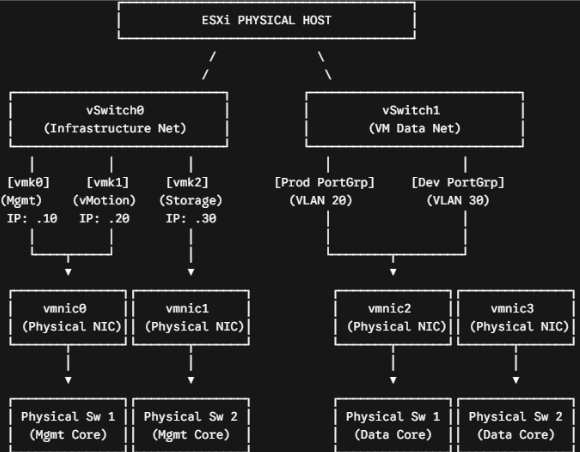

# Outline

- [Outline](#outline)
- [Hypervisor](#hypervisor)
  - [Type-1 Hypervisor](#type-1-hypervisor)
  - [Type-2 Hypervisor](#type-2-hypervisor)
  - [Type 1 vs Type 2](#type-1-vs-type-2)
- [VCSA (vCenter Server Appliance)](#vcsa-vcenter-server-appliance)
  - [VCSA is a VM](#vcsa-is-a-vm)
  - [VCSA isn't vSphere Client](#vcsa-isnt-vsphere-client)
  - [VCSA Installation Steps](#vcsa-installation-steps)
- [ESXi Ports](#esxi-ports)
  - [VMkernel Adapter (`vmk`)](#vmkernel-adapter-vmk)
  - [VM Port Group (`vNIC`) and `vmnic`](#vm-port-group-vnic-and-vmnic)
- [NIC Teaming](#nic-teaming)
  - [What it is](#what-it-is)
  - [NIC Teaming Features](#nic-teaming-features)
  - [A Typical Enterprise ESXi Network Setup](#a-typical-enterprise-esxi-network-setup)
  - [Configuration Step](#configuration-step)
- [MPIO (Multi-Path I/O)](#mpio-multi-path-io)
  - [What it is](#what-it-is-1)
  - [Path Selection Policies (PSP)](#path-selection-policies-psp)
  - [Configuration Step](#configuration-step-1)
- [Host Group](#host-group)
  - [Group Hosts and Share Volumes](#group-hosts-and-share-volumes)
  - [When to Avoid Sharing a Volume Across All Hosts](#when-to-avoid-sharing-a-volume-across-all-hosts)
- [Configure iSCSI Initiator (`esxi`)](#configure-iscsi-initiator-esxi)
  - [Step A: Configure the iSCSI Initiator on ESXi](#step-a-configure-the-iscsi-initiator-on-esxi)
  - [Step B: The "Handshake" (Discovery)](#step-b-the-handshake-discovery)
  - [What You See in the SAN Web Interface](#what-you-see-in-the-san-web-interface)

# Hypervisor

## Type-1 Hypervisor

- Example: VMware ESXi

- Run on the bare-metal hardware

- Managed remotely via a web browser (vSphere Client) or centralized management software (vCenter)

## Type-2 Hypervisor

- Example: VMware Workstation

- Run as an app on top of an existing Host OS (Windows/Linux)

## Type 1 vs Type 2

- Direct Hardware Access

    - Type 1: Interacts directly with CPU, memory, and storage without OS translation layers

    - Type 2: Calls pass through the host OS, introducing processing overhead and latency

- Performance & Latency

    - Type 1: Near-native CPU and I/O performance; ideal for high-throughput enterprise workloads

    - Type 2: Noticeable latency and performance penalty due to host OS resource scheduling

- Resource Efficiency

    - Type 1: Low footprint; host resources are dedicated almost entirely to virtual machines

    - Type 2: Host OS consumes significant CPU, RAM, and disk storage before VMs boot

- Isolation & Security

    - Type 1: Higher security surface; no host OS vulnerabilities to compromise hypervisor layer

    - Type 2: Compromising the host OS grants full access to all underlying virtual machines

# VCSA (vCenter Server Appliance)

## VCSA is a VM

- VCSA is a preconfigured VM that runs **management software** for VMware vSphere

- **VCSA is not an OS** ⇒ you do not create a blank VM, mount an ISO, and install VCSA manually like you would with a standard Windows or Linux VM

- The underlying OS is `VMware Photon OS` (a lightweight, secure version of Linux developed by VMware), and the VCSA is pre-installed inside it

## VCSA isn't vSphere Client

- The vSphere Client is the user interface (the web page you look at)

- VCSA is the backend management server that the client connects to

- You use the vSphere Client to log into and manage vCSA

## VCSA Installation Steps

- Download the Installer: You download an ISO file from VMware onto your local administrator computer (your Windows 11 machine, for example) 

- Run the Setup App: You mount that ISO and run a local application installer file (like `installer.exe`)

- Point to the Target Host: The installer asks you for the IP address and root login credentials of your bare-metal **ESXi host** 

- Automated Deployment: Once you provide those details and configure vCenter’s new static IP, the local installer takes over

- It reaches across the network into your ESXi host, automatically provisions a brand-new virtual machine, copies the pre-built VCSA operating system into it, and boots it up

# ESXi Ports

## VMkernel Adapter (`vmk`)

- A virtual IP interface living on the ESXi host itself (e.g., vmk0, vmk1)

- The ESXi Hypervisor uses VMkernel adapters to handle internal system services like Management IP, iSCSI initiator connections, and vMotion transfers

- `vmk0` is a special virtual interface created by ESXi specifically for management traffic during the initial installation

- Storage (iSCSI / NFS) ⇒ connecting the ESXi host to a network storage array where the VM virtual hard drives live

- vMotion ⇒ moving a live, running VM from one physical ESXi server to another without powering it down

- vSAN ⇒ Clustering local drives across multiple hosts into a single shared storage pool

## VM Port Group (`vNIC`) and `vmnic`

- `vNIC`: A virtual port group where VM plug their virtual network cards (vNICs) to reach the local LAN

- `vmnic` (Physical NIC) ⇒ a physical Ethernet port on the back of the PowerEdge R760 host (e.g., vmnic0, vmnic1)

# NIC Teaming

## What it is

- ESXi uses Virtual Switches (`vSwitches` or `vDS`) and NIC Teaming policies

- NIC Teaming ⇒ **one Virtual SW** can have multiple physical NICs (`vmnic`) plugged into it

    - One `vmnic` can only be plugged into one vSwitch at a time
    
    - Multiple vSwitches cannot share the same physical NIC

## NIC Teaming Features

- Route Based on Virtual Port ID (Default & Recommended)

    - **How it works:** Each VM's virtual NIC (vNIC) is assigned to a specific physical NIC on the host when the VM powers on or connects

    - **Behavior:** A single VM's traffic will only ever use one physical NIC at a time. If you have 10 VMs, 5 might go out Physical NIC 1 and 5 out Physical NIC 2

    - **Failover:** If Physical NIC 1 fails, ESXi instantly moves those 5 VMs to Physical NIC 2

- Route Based on IP Hash (Requires Switch-Side LACP/LAG)

    - **How it works:** ESXi uses the source and destination IP address of each network connection to choose an uplink

    - **Behavior:** A single VM can utilize bandwidth across multiple physical NICs simultaneously if it is communicating with multiple distinct IP addresses

    - **Requirement:** Requires a static EtherChannel/LAG or dynamic LACP configured on your HPE switches

- Explicit Failover Order (Active / Standby)

    - **How it works:** Physical NIC 1 carries all VM traffic. Physical NIC 2 sits completely idle

    - **Behavior:** Physical NIC 2 only receives traffic if Physical NIC 1 physically loses link or fails network beacon probing

## A Typical Enterprise ESXi Network Setup

## Configuration Step

- Log into vCenter Server or the ESXi Host Client

- Navigate to Host > Configure > Networking > Virtual switches

- Select your virtual switch or Port Group (e.g., vSwitch0 or VM Network) and click Edit Settings

- Select Teaming and failover from the menu

- Under Failover order, assign physical adapters to Active Adapters (e.g., move both vmnic0 and vmnic1 to Active)

- Set Load balancing based on your architecture

- Set Network failure detection to Link status only and Notify switches to Yes

# MPIO (Multi-Path I/O)

## What it is

- MPIO allows an OS (ESXi) to use multiple physical paths through your network switches simultaneously to read and write data on a storage array (like the Dell PowerVault ME5024)

- MPIO in ESXi is strictly used for storage traffic (VMkernel to SAN Arrays). It is not used for communication between VMs and the client network

- MPIO understands block storage protocols, LUN ownership, and array path states (like ALUA)

- MPIO can spread `read` and `write` commands across multiple active network links at the same time

## Path Selection Policies (PSP)

- Round Robin (VMW_PSP_RR): Cycles I/O requests across all available active paths. Recommended for performance and dynamic load balancing on ALUA/Active-Active SANs

- Most Recently Used (VMW_PSP_MRU): Uses the most recently established path until it fails, then switches to a backup

- Fixed (VMW_PSP_FIXED): Uses a single designated preferred path. Reverts to preferred path when restored

## Configuration Step

- Log into vCenter Server or the host's ESXi Embedded Host Client

- Navigate to Storage > Select your Datastore > Click the Configure tab

- Select Device Depth / Connectivity and Multipathing (or select the underlying LUN under Storage Devices)

- Click Edit Multipathing...

- Change the Path Selection Policy drop-down to Round Robin (VMW_PSP_RR)

- Verify that multiple paths show status Active or Active (I/O)

# Host Group

## Group Hosts and Share Volumes

- Enables vSphere vMotion: You can move running VMs from one physical host to another with zero downtime for maintenance or load balancing

- Supports High Availability (HA): If a physical host suddenly crashes, other hosts in the group can automatically restart the affected VMs using the shared storage

- Allows Distributed Resource Scheduling (DRS): vCenter can automatically balance workloads across all hosts in the cluster to prevent performance bottlenecks

- Simplifies Management: You manage storage datastores at the cluster level rather than configuring storage individually for each separate host

## When to Avoid Sharing a Volume Across All Hosts

- Non-Clustered Hosts: If the hosts are standalone and do not use vCenter or share a management cluster, sharing volumes is unnecessary and increases misconfiguration risks

- Security or Tenant Separation: If workloads require strict physical or logical isolation for compliance or multi-tenancy, separate distinct storage targets for specific hosts

- Non-Shared Storage: If you are using local storage (DAS) inside each server instead of a centralized SAN or NAS, you cannot share the volume across hosts

# Configure iSCSI Initiator (`esxi`)

## Step A: Configure the iSCSI Initiator on ESXi 

- On the ESXi host, you turn on the `Software iSCSI Adapter` in vSphere

- VMware automatically generates a unique IQN for that host 

- Example IQN: `iqn.1998-01.com.vmware:esxi01-6f4a8b12` 

- You assign a static IP address to an ESXi `vmkernel` port dedicated to `iSCSI` (e.g., `192.168.10.50`)

## Step B: The "Handshake" (Discovery)

- On `esxi`, under the `iSCSI` adapter settings, you enter the Controller IP addresses (e.g., `192.168.10.10` and `192.168.10.11`) as the Dynamic Target

- `esxi` sends a packet across the network saying: "Hello MSA, I am `iqn.1998-01.com.vmware:esxi01-6f4a8b12` coming from `192.168.10.50`. What storage do you have for me?"

- Once that ping occurs, the MSA logs that IQN in its Initiator Table

## What You See in the SAN Web Interface

- Now when you log into the SAN Web GUI

- You navigate to the Hosts / Initiators section

- Under "Unassociated Initiators", you will see that incoming IQN (`iqn.1998-01.com.vmware:esxi01-...`)

- You create a Host Object (e.g., name it `ESXi_Host_01`) and bind that discovered IQN to it

- If you have multiple ESXi hosts in a cluster, you group them into a Host Group (e.g., `Prod_ESXi_Cluster`)